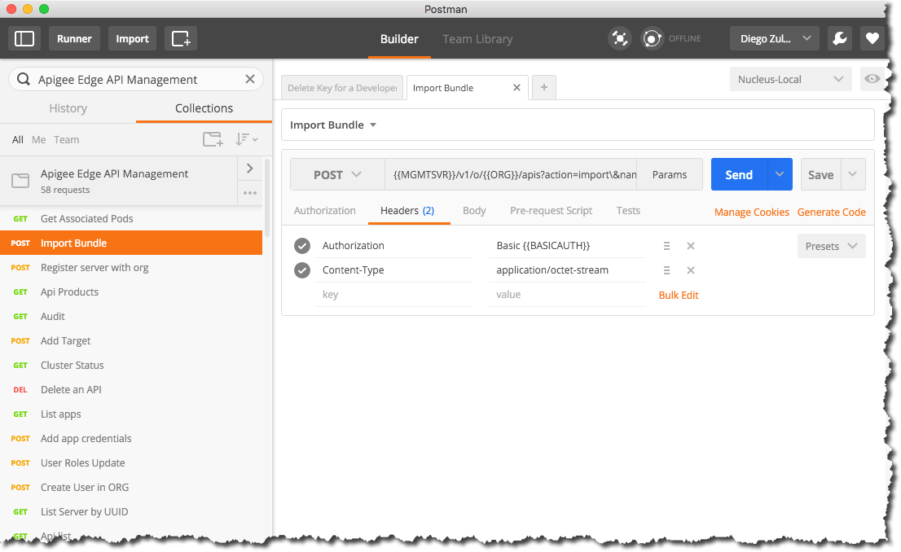

apigee-management-api-postman collection
========================================
This repo is a placeholder to maintain Apigee Management API Postman Collection. See uploaded file.

Please follow this tutorial to import this [Postman Collection](https://www.getpostman.com/docs/collections).

##Keys used in APIs:
- MGMTSVR - Management server protocol and hostname (e.g., https://yourOrg-yourEnv.apigee.net)
- ORG - organization
- ENV - environment
- API - API name
- BASICAUTH - Basic Auth header consisting of base64(admin id:admin pwd)
- PROTO - protocol
- HOST - hostname
